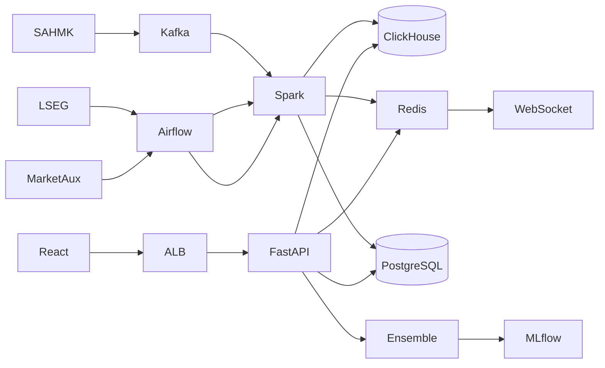

# تاسي فيجن — TASI Vision

## ملخص تنفيذي

**تاسي فيجن** منصة مؤسسية لأدوات تحليل سوق تاسي (مع إخلاء مسؤولية CMA) عبر Ensemble (XGBoost + LSTM + Prophet + AraBERT) بدقة مستهدفة ≥ 78% AUC-ROC. البيانات: SAHMK لحظي كل 3 ثوانٍ، LSEG للتاريخ والإغلاق، MarketAux للأخبار؛ failover إلى Tadawul/Redis. **النشر الحالي: [Railway.com](docs/RAILWAY.md)**. القرارات المعتمدة موثّقة في [`docs/DECISIONS.md`](docs/DECISIONS.md).

---

## التشغيل السريع (تطوير محلي)

```bash
cp .env.example .env
# عدّل SECRET_KEY ومفاتيح APIs
docker compose up --build
```

- API + Swagger: http://localhost:8000/docs  
- Frontend Dashboard: http://localhost:3000  
- MLflow: http://localhost:5000  

```bash
# اختبارات الوحدة
pip install -r ml/requirements.txt -r backend/requirements.txt
PYTHONPATH=. pytest ml/tests backend/tests -q
```

التفاصيل المعمارية الكاملة: [`docs/ARCHITECTURE.md`](docs/ARCHITECTURE.md)  
هيكل المجلدات: [`docs/PROJECT_STRUCTURE.md`](docs/PROJECT_STRUCTURE.md)

---

## المرحلة الأولى: التصميم المعماري

### البنية التحتية (Mermaid)

انظر الرسم الكامل في [`docs/ARCHITECTURE.md`](docs/ARCHITECTURE.md) — ملخص التدفق:



### تفاعل المكونات

| المسار | التفاعل |
|--------|---------|
| لحظي | SAHMK → Kafka `tasi.ticks` → Spark Streaming → ClickHouse + Redis Pub/Sub → `/ws/live` |
| يومي | Airflow → LSEG → Spark → `ohlcv_daily` + ميزات ML |
| أخبار | Airflow ساعي → MarketAux → AraBERT → `news_sentiment` |
| توصية | API → Inference/Ensemble → Risk Engine → PostgreSQL + SHAP نصي |

### اختيار التقنيات

| تقنية | لماذا |
|-------|-------|
| FastAPI | async + OpenAPI + Type Hints لمسارات منخفضة الكمون |
| React/TS | لوحة تحكم مؤسسية مع Lightweight Charts و RTL |
| PostgreSQL | ACID للمستخدمين/المحافظ/التوصيات/RBAC |
| ClickHouse | تجميعات زمنية سريعة على OHLCV والتنبؤات |
| Redis | Cache-aside + Pub/Sub + Rate Limit |
| Kafka/Spark/Airflow | فصل المنتجين، تحمل ضغط 5 ثوانٍ، جدولة واضحة |
| MLflow/Kubeflow | تسجيل النماذج، champion/challenger، خطوط تدريب |
| EKS + ArgoCD | تشغيل وإنتاج GitOps |

### Failover واستمرارية الخدمة

- API: ≥3 replicas + PDB + probes خلف ALB/WAF (TLS 1.3)
- PostgreSQL: RDS Multi-AZ + PITR
- ClickHouse/Kafka/Redis: replication مع رجوع cache-aside عند فشل Redis
- ML: blue/green عبر aliases في MLflow مع rollback فوري
- Circuit breaker لمزودي البيانات + علامة `stale`
- هدف uptime 99.9% — RPO ≤ 15 دقيقة، RTO ≤ 1 ساعة

### Checklist — المرحلة الأولى

- [ ] اعتماد مناطق التوافر وعقود مزودي البيانات
- [ ] تعريف SLOs في Grafana (p95 < 200ms، live < 1s)
- [ ] Runbooks للـ Failover وDR
- [ ] سياسات WAF و Rate Limit عند الحافة

---

## المرحلة الثانية: هيكل قاعدة البيانات

| المخزن | الملف |
|--------|-------|
| PostgreSQL ERD/DDL | [`database/postgres/001_schema.sql`](database/postgres/001_schema.sql) |
| ClickHouse | [`database/clickhouse/001_schema.sql`](database/clickhouse/001_schema.sql) |
| Redis Keys + TTL | [`database/redis/KEYS.md`](database/redis/KEYS.md) |
| 3 استعلامات أساسية | [`database/postgres/queries.sql`](database/postgres/queries.sql) |

الاستعلامات الثلاثة:

1. **آخر 30 سعر** لرمز معيّن  
2. **أفضل التوصيات** النشطة حسب الثقة  
3. **أداء المحفظة** (تكلفة، قيمة سوقية، عائد غير محقق)

### Checklist — المرحلة الثانية

- [ ] تطبيق ترحيلات PostgreSQL + تهيئة ClickHouse
- [ ] ضبط TTL لمفاتيح Redis حسب `KEYS.md`
- [ ] تشفير الحقول الحساسة (MFA secrets) AES-256
- [ ] سياسة احتفاظ Audit Log = 90 يوم

---

## المرحلة الثالثة: نماذج الذكاء الاصطناعي

| المكوّن | المسار |
|---------|--------|
| Feature Engineering | [`ml/features/technical_indicators.py`](ml/features/technical_indicators.py) |
| XGBoost + SHAP + MLflow | [`ml/models/xgboost_model.py`](ml/models/xgboost_model.py) |
| LSTM (60d, Dropout, EarlyStopping, CUDA) | [`ml/models/lstm_model.py`](ml/models/lstm_model.py) |
| Ensemble + Risk + شرح عربي | [`ml/ensemble/ensemble_model.py`](ml/ensemble/ensemble_model.py) |
| تدريب موحّد | [`ml/training/train_pipeline.py`](ml/training/train_pipeline.py) |

```bash
PYTHONPATH=. python -m ml.training.train_pipeline --data data/sample_ohlcv.csv --model both --mlflow-uri http://localhost:5000
```

أهداف النماذج: LSTM 72% · XGBoost 68% · Prophet 65% · Ensemble ≥ 78% AUC-ROC  
التوصيات: شراء قوي / شراء / محايد / بيع · SL=ATR×2 · TP=2.5R · مخاطرة 1.5% (حد 2%)

### Checklist — المرحلة الثالثة

- [ ] بيانات تاريخية سائلة ≥ 5 سنوات
- [ ] تدريب زمني (لا shuffle) + تسجيل MLflow
- [ ] تقييم out-of-time لـ Ensemble ≥ 0.78
- [ ] تقارير SHAP عربية لكل توصية إنتاجية

---

## المرحلة الرابعة: Backend API والواجهة

### Endpoints

| Method | Path | الوصف |
|--------|------|--------|
| GET | `/api/stock/{symbol}` | سعر، حجم، مؤشرات |
| GET | `/api/recommendation/{symbol}` | توصية + SHAP |
| POST | `/api/portfolio` | إنشاء محفظة + أسهم |
| GET | `/api/portfolio/{id}/performance` | أداء المحفظة |
| WS | `/ws/live` | تحديثات لحظية |
| GET | `/api/market/overview` | مؤشرات السوق للوحة التحكم |
| GET | `/docs` | Swagger/OpenAPI |

الكود: [`backend/app/`](backend/app/)  
Dashboard: [`frontend/src/pages/Dashboard.tsx`](frontend/src/pages/Dashboard.tsx) — نظرة سوق، توصيات مرتبة بالثقة، Lightweight Charts، فلترة قطاع/مخاطرة.

### الأمن والحوكمة

- TLS 1.3 عند الحافة · AES-256 للحقول الحساسة · JWT + MFA · RBAC (`user`/`analyst`/`admin`)
- Rate limit: 100 طلب/دقيقة · Audit log 90 يوم

### Checklist — المرحلة الرابعة

- [ ] `docker compose up` أخضر محلياً
- [ ] اختبار WebSocket والاشتراك بالرموز
- [ ] ربط الشارت ببيانات ClickHouse الحقيقية
- [ ] اجتياز pytest ومعايير القبول (latency stubs + backtest)

---

## خطة 8 أشهر ومعايير القبول

| الفترة | المخرجات |
|--------|----------|
| 1–2 | بيئات، قواعد بيانات، ETL أساسي |
| 3–4 | XGBoost + Prophet |
| 5–6 | LSTM + NLP + Ensemble + SHAP |
| 7–8 | API + Frontend + تكامل + قبول |

| المعيار | الهدف |
|---------|-------|
| Ensemble AUC-ROC | ≥ 78% |
| Sharpe | > 1.5 |
| Hit Rate | > 60% |
| Max Drawdown | < 15% |
| Uptime | 99.9% |
| API Response | < 200ms |
| Live Latency | < 1s |

---

## قرارات معتمدة (تم تثبيتها)

انظر التفاصيل الكاملة: [`docs/DECISIONS.md`](docs/DECISIONS.md)

| البند | القرار |
|-------|--------|
| لحظي | SAHMK WS كل 3ث → LSEG 10ث → Tadawul → Redis |
| رموز | داخلي/`SAHMK`/`MarketAux`: `2222` · LSEG: `2222.SR` |
| تغطية | 350+ أساسي · 120 متقدم (شهري) · إضافة يدوية |
| أفق | 5 (أساسي) · 10/20 اختياري · جدولة 06:00 و 12:00 |
| امتثال | أدوات تحليل + إخلاء مسؤولية · Audit 5 سنوات · موافقة CMA مبدئية |
| سحابة | Railway.com (إنتاج حالي) · AWS لاحق اختياري |
| هوية | تاسي فيجن · `#1A7A4E` / `#0A4D8C` / `#C9A84C` · وزير + Inter |
| تسعير محفظة | جلسة=SAHMK · إغلاق=LSEG · فشل=Redis |

### حالة الربط الحي

- ✅ **SAHMK REST** مربوط
- ✅ **SAHMK WebSocket** مفعّل بأوسع تغذية للخطة الحالية (**60 رمزاً** على Pro؛ `*` يتطلب Enterprise)
- ✅ **مزامنة شركات تاسي** (`POST /api/companies/sync`) — ~270 شركة
- ✅ **شموع تاريخية** (`GET /api/stock/{symbol}/candles`) + تسخين الكون
- ✅ **Dashboard** مربوط بـ `/ws/live` والشموع الحقيقية
- ✅ **نشر Railway** حي: https://dede-production-c796.up.railway.app/
- ⏳ خدمة **web** (واجهة React) إن لم تُنشأ بعد + ضبط `VITE_*`
- ⏳ التأكد من `DATABASE_URL` / `REDIS_URL` عبر `/api/health/detail`
- ⏳ `LSEG_API_KEY` / `MARKETAUX_API_KEY` / `TADAWUL_API_KEY`

```bash
# فحص بث سهمك مباشرة
PYTHONPATH=.:backend python scripts/smoke_sahmk_ws.py
# حالة البث عبر API
curl -s http://localhost:8000/api/stream/status
```

---

## ترخيص

انظر [`LICENSE`](LICENSE).
