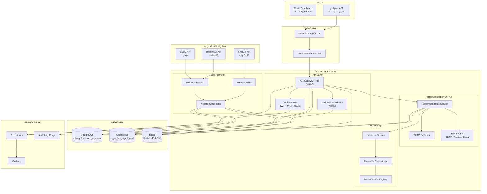
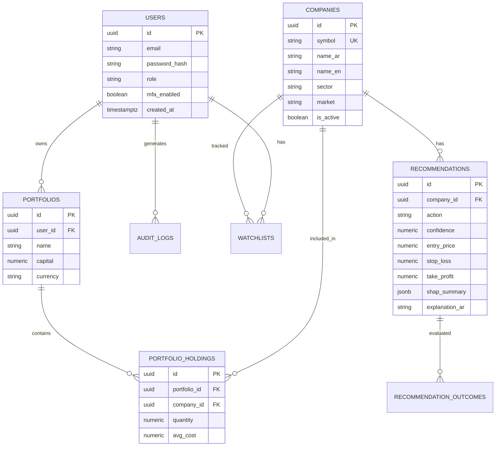

# منصة تحليل سوق الأسهم السعودي (تاسي) — مخطط تنفيذي شامل

## ملخص تنفيذي

منصة مؤسسية لتحليل سوق تاسي وإصدار توصيات استثمارية مدعومة بـ Ensemble (XGBoost + LSTM + Prophet + AraBERT) بدقة مستهدفة ≥ 78% AUC-ROC. تعتمد البنية على Clean Architecture مع FastAPI و React و PostgreSQL/ClickHouse/Redis، وتدفق بيانات عبر Kafka + Spark + Airflow من SAHMK و LSEG و MarketAux. تُنشر على AWS EKS مع GitOps (ArgoCD) ومراقبة Prometheus/Grafana، مع أهداف تشغيل: uptime 99.9% واستجابة API أقل من 200ms. هذا المستودع جاهز لتسليمه لفريق تطوير للبدء مباشرة بعد الإجابة على الأسئلة المفتوحة في نهاية الوثيقة.

---

## المرحلة الأولى: التصميم المعماري (Architecture Design)

### 1.1 رسم البنية التحتية (Mermaid)

### 1.2 تفاعل المكونات

| التدفق | الوصف |
|--------|--------|
| Live Ingest | SAHMK → Kafka topic `tasi.ticks` كل 5 ثوانٍ → Spark Streaming يطبّع الشموع ويكتب إلى ClickHouse + ينشر إلى Redis Pub/Sub |
| Daily History | Airflow DAG يومي يسحب LSEG → Spark batch → ClickHouse `ohlcv_daily` + تحديث ميزات ML |
| News/NLP | Airflow كل ساعة → MarketAux → AraBERT sentiment → ClickHouse `news_sentiment` |
| Inference | عند طلب توصية أو جدولة دقائقية: Inference Service يحمّل أحدث نموذج من MLflow → Ensemble → Risk Engine → PostgreSQL `recommendations` |
| Live Push | Redis Pub/Sub → WebSocket workers → العملاء المتصلون على `/ws/live` |
| Explainability | SHAP يحسب مساهمة الميزات ويُخزَّن ملخص نصي عربي مع التوصية |

### 1.3 اختيار التقنيات مع التبرير

| التقنية | التبرير |
|---------|---------|
| **FastAPI** | أداء عالٍ async، OpenAPI تلقائي، Type Hints أصلية — مثالي لـ API مالي حساس للزمن |
| **React + TypeScript** | نظام بيئي ناضج، Lightweight Charts، RTL، قابلية صيانة للمؤسسات |
| **PostgreSQL** | ACID للمعاملات (مستخدمين، محافظ، صلاحيات، توصيات) |
| **ClickHouse** | استعلامات زمنية مجمّعة سريعة على OHLCV والمؤشرات والتنبؤات |
| **Redis** | Cache للقراءات الساخنة + Pub/Sub للتحديثات اللحظية + Rate Limiting |
| **Kafka + Spark** | فصل المنتجين عن المستهلكين، تحمل ضغط التحديث كل 5 ثوانٍ، معالجة دفعية وتدفقية |
| **Airflow** | جدولة ETL واضحة وقابلة للمراقبة (يومي/ساعي) |
| **XGBoost / LSTM / Prophet / AraBERT** | تغطية أنماط جدولية + تسلسلية + موسمية + مشاعر عربية |
| **MLflow + Kubeflow** | تتبّع التجارب، تسجيل النماذج، خطوط تدريب على EKS |
| **EKS + ArgoCD + GitHub Actions** | تشغيل سحابي مؤسسي مع GitOps |
| **Prometheus + Grafana** | SLOs: latency، uptime، أخطاء الاستدلال |

### 1.4 Failover واستمرارية الخدمة

- **API**: Deployment بـ ≥ 3 replicas خلف ALB مع readiness/liveness probes و PodDisruptionBudget.
- **PostgreSQL**: Multi-AZ RDS مع failover تلقائي؛ نسخ احتياطي يومي + PITR.
- **ClickHouse**: مجموعة replicas (2+) مع ZooKeeper/ClickHouse Keeper؛ كتابة مع `ReplicatedMergeTree`.
- **Redis**: ElastiCache Redis في وضع Cluster/Failover؛ إن فشل الكاش يتم الرجوع إلى المصدر (cache-aside) دون انقطاع.
- **Kafka**: عامل replication factor = 3 و `min.insync.replicas = 2`.
- **ML Serving**: نموذجان نشطان (blue/green) عبر MLflow aliases (`champion`/`challenger`) مع rollback فوري.
- **Circuit Breaker**: تجاه مصادر SAHMK/LSEG/MarketAux مع تخزين آخر قيمة صالحة وعلامة `stale`.
- **DR**: نسخ لقطة يومية إلى منطقة ثانوية؛ RPO ≤ 15 دقيقة، RTO ≤ 1 ساعة للمسار الحرج.
- **هدف Uptime**: 99.9% عبر فحوصات صحية ومناطق توافر متعددة.

### Checklist — المرحلة الأولى

- [ ] اعتماد مخطط EKS ومناطق التوافر (AZs)
- [ ] تأكيد عقود SAHMK / LSEG / MarketAux وحدود المعدل
- [ ] تعريف SLOs في Grafana (p95 latency، error rate، uptime)
- [ ] تصميم استراتيجية blue/green لنماذج MLflow
- [ ] توثيق Runbooks للـ Failover

---

## المرحلة الثانية: هيكل قاعدة البيانات (Database Schema)

انظر الملفات التنفيذية:

- `database/postgres/001_schema.sql`
- `database/clickhouse/001_schema.sql`
- `database/redis/KEYS.md`
- `database/postgres/queries.sql`

### 2.1 PostgreSQL ERD (Mermaid)

### Checklist — المرحلة الثانية

- [ ] تشغيل ترحيلات Alembic على بيئة التطوير
- [ ] إنشاء جداول ClickHouse مع TTL للبيانات الدقيقة
- [ ] ضبط مفاتيح Redis وTTL حسب `KEYS.md`
- [ ] التحقق من الاستعلامات الثلاثة الأساسية على بيانات عيّنة
- [ ] سياسات تشفير AES-256 للحقول الحساسة (PII)

---

## المرحلة الثالثة: تنفيذ نموذج الذكاء الاصطناعي

انظر:

- `ml/features/technical_indicators.py`
- `ml/models/xgboost_model.py`
- `ml/models/lstm_model.py`
- `ml/ensemble/ensemble_model.py`
- `ml/training/train_pipeline.py`

### Checklist — المرحلة الثالثة

- [ ] تجهيز بيانات تاريخية ≥ 5 سنوات لأسهم تاسي السائلة
- [ ] تدريب XGBoost مع تقسيم زمني و Hyperparameter Tuning
- [ ] تدريب LSTM على GPU مع EarlyStopping
- [ ] تسجيل النماذج في MLflow + تقييم SHAP
- [ ] بناء Ensemble والتحقق من AUC ≥ 0.78 على out-of-time test

---

## المرحلة الرابعة: Backend API والواجهة الأمامية

انظر:

- `backend/app/` — FastAPI Clean Architecture
- `frontend/src/pages/Dashboard.tsx`
- `docker-compose.yml`
- `.env.example`

### Checklist — المرحلة الرابعة

- [ ] تشغيل `docker compose up` محلياً
- [ ] التحقق من Swagger على `/docs`
- [ ] اختبار WebSocket `/ws/live`
- [ ] ربط Dashboard بالمؤشرات والتوصيات والفلاتر
- [ ] اجتياز اختبارات `pytest` و معايير القبول (latency / hit-rate stub)

---

## خطة التنفيذ المرحلية (8 أشهر)

| الفترة | المخرجات |
|--------|----------|
| الأشهر 1–2 | بيئات AWS/EKS، PostgreSQL/ClickHouse/Redis، ETL أساسي (Kafka + Airflow) |
| الأشهر 3–4 | XGBoost + Prophet، خطوط ميزات، تقييم أولي |
| الأشهر 5–6 | LSTM + AraBERT + Ensemble + SHAP + Risk Engine |
| الأشهر 7–8 | FastAPI كامل، React Dashboard، تكامل، اختبارات قبول، إطلاق تجريبي |

## معايير القبول

| المعيار | الهدف |
|---------|-------|
| Ensemble AUC-ROC | ≥ 78% |
| Sharpe Ratio | > 1.5 |
| Hit Rate | > 60% |
| Max Drawdown | < 15% |
| Uptime | 99.9% |
| API Response | < 200ms |
| Live Latency | < 1s |

---

## قرارات معتمدة

جميع الأسئلة المفتوحة أُجيبت وثُبّتت في [`docs/DECISIONS.md`](DECISIONS.md)  
(مصادر البيانات، الرموز، التغطية، الآفاق، CMA، AWS، الهوية، تسعير المحفظة).
